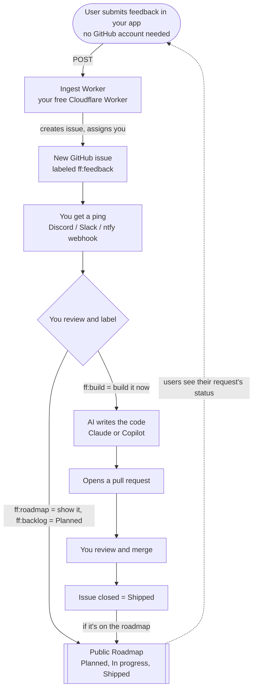

# faster-features

**Turn in-app user feedback into shipped features, fast.**

A user clicks **Feedback** in your app → it becomes a triaged GitHub issue → your
phone buzzes → you add a label → an AI writes the code and opens a PR. Optionally,
a public **roadmap** shows users what's planned, in progress, and shipped — so the
loop closes back to the people who asked.

Built on two rules:

1. **Free and off your infrastructure** — everything rides on free tiers (GitHub +
   a Cloudflare Worker). The *only* thing that costs anything is the AI that writes
   the code, on your own subscription or API key, and only when you approve a build.
2. **End users never touch GitHub** — no account, no idea a pipeline exists. They
   type feedback and hit Send.

## How it works



The **Worker is the only thing you host** — a small, free, stateless Cloudflare
Worker on your own account. It holds your GitHub token (so the browser never sees
it), creates issues, assigns you, serves the widget, powers the roadmap, and
handles the build label. Nothing else gets copied into your app repo.

## Quickstart (~5 min)

**Prerequisites:** a GitHub repo for your app, a free
[Cloudflare](https://dash.cloudflare.com) account, and [Node.js](https://nodejs.org).

### 1. Deploy the ingest Worker (once per app)

Grab just the worker folder (no full clone) and run setup:

```bash
npx degit appuruguru/faster-features/packages/ingest-worker ff-ingest
cd ff-ingest
npm install
npm run setup
```

Setup prompts for your repo + a build runner, opens the two token pages
(**GitHub** + **Cloudflare** — see the [FAQ](#faq) on what they need), then
deploys, creates the `ff:` labels, registers the webhook, and **prints your embed
snippet**. Full walkthrough + the no-terminal button: [docs/deploy-ingest.md](docs/deploy-ingest.md).

> **Windows/PowerShell:** if `npm`/`npx` is blocked by execution policy, run
> `Set-ExecutionPolicy -Scope Process -ExecutionPolicy Bypass` once and retry.

### 2. Add one line to your app

Paste what setup printed, before `</body>`:

```html
<script src="https://your-worker.workers.dev/widget.js"></script>
```

That's it — a Feedback button appears, submissions become triaged issues, you get
a push, and adding `ff:build` kicks off your AI runner. (For a public roadmap, add
a page with `roadmap.js` — see [examples/roadmap.html](examples/roadmap.html).)

> Or let AI wire it in: run the [`/faster-features` skill](skills) in Claude Code,
> or point any agent at [AGENTS.md](AGENTS.md).

## What's in here

| Piece | What it is |
| --- | --- |
| [`packages/widget`](packages/widget) | Drop-in feedback button **and** public roadmap (vanilla JS + React). No token. |
| [`packages/ingest-worker`](packages/ingest-worker) | The Cloudflare Worker: issues, notify, roadmap, votes, webhook builds, serves the widgets. |
| [`.github/`](.github) | Issue template + an **optional** `build.yml` (only for the `claude-api` runner). |
| [`faster-features.config.yml`](faster-features.config.yml) | One config file: repo, owner, ingest URL, build runner. |
| [`docs/`](docs) | [Deploy](docs/deploy-ingest.md) · [Build runners](docs/build-runners.md) · [Troubleshooting](docs/troubleshooting.md) |
| [`SECURITY.md`](SECURITY.md) | What's stored where; no secrets in git, no PII by default. |
| [`examples/`](examples) | A demo page for the widget and a roadmap page template. |

## Cost

| Step | Cost |
| --- | --- |
| Widget · ingest · issues · roadmap · notifications | **Free** (Cloudflare + GitHub free tiers) |
| **AI build** | Your Claude subscription (manual kickoff) — or pay-per-token API / usage-based Copilot for hands-off |

A *fully free and fully automated* build isn't possible without violating a
provider's terms (Anthropic doesn't allow subscription tokens in CI). The default
**`claude-manual`** runner is the sweet spot: you kick off the build in Claude Code
on your existing subscription — that tap is also your approval — and everything
else stays free.

## FAQ

**Does it cost money?** Only the AI build step. Capturing feedback, issues, the
roadmap, and notifications are all free. With `claude-manual` you build on your
existing Claude subscription, so there's no extra cost at all.

**Do end users need a GitHub account?** No. They only ever see your app's feedback
form.

**How do I get notified of new feedback?** Set a notification webhook (Discord,
Slack, or ntfy) during setup — the Worker pings it on every submission. The Worker
also assigns you to the issue, but GitHub **won't** push you for that: your own
token does the assigning, and GitHub suppresses notifications for your own actions.
So the webhook is the reliable channel.

**Do I need new tokens for each app?** No. **One** classic `repo` GitHub token and
**one** Cloudflare API token work for all your apps — reuse them. **Save them in a
password manager** (GitHub shows a token only once). Regenerating a token revokes
the old value and breaks apps already using it, so for a new app create a *new*
token rather than regenerating.

**Are my tokens stored in git or on disk?** No. The GitHub token lives only as an
encrypted Cloudflare Worker secret; the Cloudflare token is used during setup and
never stored. `wrangler.toml` holds only non-secret config. See [SECURITY.md](SECURITY.md).

**What are the `ff:` labels?** The pipeline's labels, prefixed `ff:` so they don't
get confused with GitHub's stock labels. They're created automatically — you never
make them by hand.

**Which label puts something on the roadmap?** `ff:roadmap` shows it; the column
comes from `ff:backlog` (Planned), `ff:build`/`ff:in-progress` (In progress), or
closing the issue (Shipped).

**How do I actually build an approved issue?** Add `ff:build`, then open **Claude
Code (CLI, desktop, or web)** and say *"implement issue #N, open a PR."* It reads
the issue and builds on your subscription. Prefer hands-off? Use the `copilot` or
`claude-api` runner (see [docs/build-runners.md](docs/build-runners.md)).

**Can I use it across multiple apps?** Yes. Each app gets its own worker
(`ff-<repo>`) and its own data — no collisions — and you reuse the same two tokens.

**Do I have to redeploy when faster-features updates?** Backend (worker) changes:
yes, re-run setup. Pure widget/cosmetic changes: those can be served from a CDN to
avoid redeploys — a planned option.

## Where this is headed

Today faster-features is **self-host**: you deploy your own worker (~5 min) and own
all your data and infra. The aim is an optional **hosted version** down the road —
where adopting it is just an install script (or a GitHub App + snippet) with no
deploy at all. The self-host path will always stay free and available.

## License

[Functional Source License 1.1 (MIT Future)](LICENSE) — **FSL-1.1-MIT**.

In plain terms: **use it freely** — self-host it, modify it, run it for your own
apps and your business. The one thing you can't do is **sell a competing product
or hosted service** that's basically this. Two years after each release, that
version automatically becomes **MIT** (fully open). It's "source-available," not
OSI open-source, precisely so it stays free to adopt without someone reselling it.
